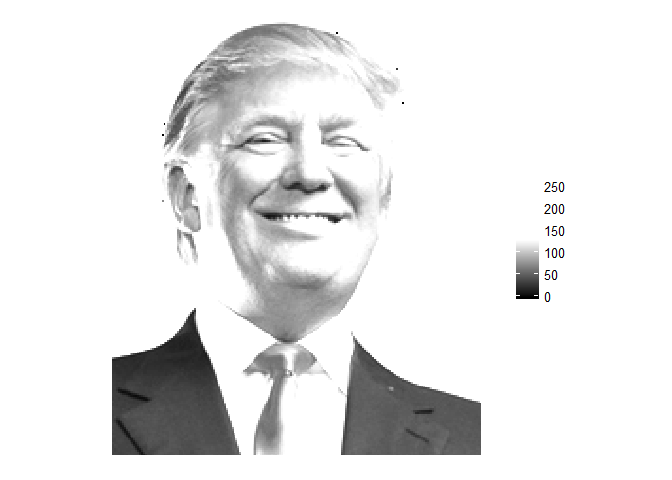

-   [Generate Personalized Profile Picture with R](#generate-personalized-profile-picture-with-r)
    -   [Data Preparation](#data-preparation)
    -   [Plot with `ggplot`](#plot-with-ggplot)
        -   [Plot part of the picture](#plot-part-of-the-picture)
        -   [Plot with red, green, or blue](#plot-with-red-green-or-blue)
        -   [RGB color filter](#rgb-color-filter)
        -   [Change palette](#change-palette)
    -   [Add another layer](#add-another-layer)

Generate Personalized Profile Picture with R
============================================

Thanks to the powerful ggplot system, you can generate various plot. Believe it or not, you can even use it as a Photoshop to personalize your picutres.

Data Preparation
----------------

Firstly, we need to prepare a picture in PNG format for this exercise. The color in each pixel is extracted as a raster with the `rasterGrob` function. Then the raster is converted into a data frame, so that it can be used in `ggplot`

``` r
library(png)
library(reshape)
library(grid)
library(ggplot2)
library(dplyr)
library(grDevices)
library(maps)
library(scales)

img <- readPNG('C:/Users/Jianhua/Dropbox/work_doc/github/Personalized_Profile_Picture/Trump.png')
g <- rasterGrob(img, interpolate=TRUE)

df.pic <- melt(as.matrix(g$raster)) %>%
  transmute(x = X2, y = max(X1) - X1, color = value)

df.pic <- filter(df.pic, color != '#00000000')  # remove the background
```

Plot with `ggplot`
------------------

using the `ggplot` function, we can plot the picture directly.

``` r
ggplot(df.pic, aes(x = x, y = y)) +
  geom_raster(aes(fill = color)) + 
  scale_fill_identity() +
  coord_equal() + 
  theme_void()
```


### Plot part of the picture

we can also select part of the picture to plot by filtering part of the data.

``` r
df.part <- filter(df.pic, x > max(x) * .4, x < max(x) * .6, y > max(y) * .6)

ggplot(df.part, aes(x = x, y = y)) +
  geom_raster(aes(fill = color)) + 
  scale_fill_identity() +
  coord_equal() + 
  theme_void()
```


### Plot with red, green, or blue

Using the `col2rgb` function, we can divide the hex value for each color into three components: red, green, and blue.

``` r
# divide the color hex value into red, green, and blue
df.part <- data.frame(df.part, t(col2rgb(df.part$color)))

ggplot(df.part, aes(x = x, y = y, fill = red)) +
  geom_raster() + 
  scale_fill_continuous(high = 'white', low = 'red') + 
  coord_equal() + 
  theme_void()
```


``` r
ggplot(df.part, aes(x = x, y = y, fill = green)) +
  geom_raster() + 
  scale_fill_continuous(high = 'white', low = 'green') + 
  coord_equal() + 
  theme_void()
```


``` r
ggplot(df.part, aes(x = x, y = y, fill = blue)) +
  geom_raster() + 
  scale_fill_continuous(high = 'white', low = 'blue') + 
  coord_equal() + 
  theme_void()
```


### RGB color filter

We can also use the rgb as color, and change the multiplier for red, green, or blue to filter the value for each component

For example, reduce the multiplier for red, to filter out the red spectrum

``` r
## color filter
ggplot(df.part, aes(x = x, y = y)) +
  geom_raster(fill= rgb(
    red = 0 * df.part$red, 
    green = 1 * df.part$green, 
    blue = 1 * df.part$blue,
    max = 255)) + 
  coord_equal() + 
  theme_void()
```


Reduce the multiplier for blue, to filter out the blue spectrum

``` r
## color filter
ggplot(df.part, aes(x = x, y = y)) +
  geom_raster(fill= rgb(
    red = 1 * df.part$red, 
    green = 1 * df.part$green, 
    blue = 0.5 * df.part$blue,
    max = 255)) + 
  coord_equal() + 
  theme_void()
```


### Change palette

The `scale_fill_gradient*` function in ggplot make it easy to change the color or use some special palette

``` r
## without alpha, the last layer covers all previous
p <- ggplot(df.part, aes(x = x, y = y)) +
  geom_raster(aes(fill = red), alpha = 1) +
  geom_raster(aes(fill = blue), alpha = .67) +
  geom_raster(aes(fill = green), alpha = .33) +
  coord_equal() + 
  theme_void()

p + scale_fill_gradient2(high = 'white', low = 'black', midpoint = 128)
```



``` r
p + scale_fill_gradient2(high = 'black', low = 'white', midpoint = 128)
```


``` r
p + scale_fill_gradient2(high = 'red', low = 'blue', midpoint = 128)
```


``` r
p + scale_fill_gradient2(high = 'red', low = 'blue', mid = 'yellow', midpoint = 128)
```


``` r
p + scale_fill_gradientn(colors = rev(rainbow(7)))
```


Add another layer
-----------------

With the `ggplot`, you can easily add another layer/component to the figure such as text, other pictures, or even a map:

``` r
states_map <- map_data('state') 
df.part$x <- rescale(df.part$x, to = c(-112, -80))
df.part$y <- rescale(df.part$y, to = c(28, 50))

ggplot(df.part, aes(x = x, y = y)) +
  geom_polygon(data = states_map, aes(x = long, y = lat, group = group), 
    fill = 'lightskyblue1', color = 'grey20', alpha = .2) + 
  geom_raster(aes(fill = red), alpha = .9) +
  scale_fill_gradient2(high = 'red', low = 'blue', mid = 'yellow', midpoint = 128) + 
  theme_void() +
  guides(color = FALSE, fill = FALSE)
```


Now, it is your turn to further personalize the picture.
